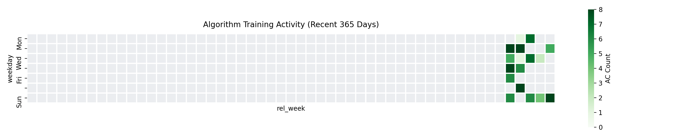

# 🏆 Algorithm Training Log
> 🎯 **Goal:** ACM Silver Medal | *Last updated: 2026-03-11 22:04:36*

## 📈 Heatmap

--- 

## 🕒 Dashboard

<table width="100%">
    <tr>
        <td width="50%" valign="top">
            <h4 align="center">✅ 最近 AC (5)</h4>
            <table width="100%">
                <thead><tr><th align="center">平台</th><th align="left">题目</th><th align="right">日期</th></tr></thead>
                <tbody>
                <tr><td align='center'><code>Codeforces</code></td><td><a href='https://codeforces.com/contest/2207/problem/B'>2207B</a></td><td align='right'>03-11</td></tr><tr><td align='center'><code>Codeforces</code></td><td><a href='https://codeforces.com/contest/2200/problem/E'>2200E</a></td><td align='right'>03-08</td></tr><tr><td align='center'><code>Codeforces</code></td><td><a href='https://codeforces.com/contest/2205/problem/D'>2205D</a></td><td align='right'>03-03</td></tr><tr><td align='center'><code>Codeforces</code></td><td><a href='https://codeforces.com/contest/2205/problem/C'>2205C</a></td><td align='right'>03-01</td></tr><tr><td align='center'><code>Codeforces</code></td><td><a href='https://codeforces.com/contest/2205/problem/B'>2205B</a></td><td align='right'>03-01</td></tr>
                </tbody>
            </table>
        </td>
        <td width="50%" valign="top">
            <h4 align="center">⌛ 积压最久 (5)</h4>
            <table width="100%">
                <thead><tr><th align="center">平台</th><th align="left">题目</th><th align="right">日期</th></tr></thead>
                <tbody>
                <tr><td align='center'><code>Codeforces</code></td><td><a href='https://codeforces.com/gym/105198/problem/G'>105198G</a></td><td align='right'>01-28</td></tr><tr><td align='center'><code>Codeforces</code></td><td><a href='https://codeforces.com/contest/940/problem/F'>940F</a></td><td align='right'>01-29</td></tr><tr><td align='center'><code>Codeforces</code></td><td><a href='https://codeforces.com/contest/2189/problem/C2'>2189C2</a></td><td align='right'>01-29</td></tr><tr><td align='center'><code>Codeforces</code></td><td><a href='https://codeforces.com/contest/2188/problem/D'>2188D</a></td><td align='right'>01-30</td></tr><tr><td align='center'><code>Codeforces</code></td><td><a href='https://codeforces.com/gym/102890/problem/M'>102890M</a></td><td align='right'>01-30</td></tr>
                </tbody>
            </table>
        </td>
    </tr>
</table>

--- 

## 📊 AC History

| 日期 | Codeforces | Luogu | Nowcoder | **Total** |
| :--- | :---: | :---: | :---: | :---: |
| [2026-03-09](./DailyLogs/2026-03-09.md) | 1 | - | - | **1** |
| [2026-03-08](./DailyLogs/2026-03-08.md) | 1 | - | - | **1** |
| [2026-03-01](./DailyLogs/2026-03-01.md) | 9 | - | - | **9** |
| [2026-02-24](./DailyLogs/2026-02-24.md) | 5 | - | - | **5** |
| [2026-02-22](./DailyLogs/2026-02-22.md) | 4 | - | - | **4** |
| [2026-02-18](./DailyLogs/2026-02-18.md) | - | - | 2 | **2** |
| [2026-02-15](./DailyLogs/2026-02-15.md) | - | - | 6 | **6** |
| [2026-02-11](./DailyLogs/2026-02-11.md) | - | - | 7 | **7** |
| [2026-02-09](./DailyLogs/2026-02-09.md) | - | - | 7 | **7** |
| [2026-02-07](./DailyLogs/2026-02-07.md) | - | - | 8 | **8** |
| [2026-02-05](./DailyLogs/2026-02-05.md) | - | - | 6 | **6** |
| [2026-02-04](./DailyLogs/2026-02-04.md) | - | - | 1 | **1** |
| [2026-02-03](./DailyLogs/2026-02-03.md) | - | - | 8 | **8** |
| [2026-02-02](./DailyLogs/2026-02-02.md) | 1 | - | - | **1** |
| [2026-02-01](./DailyLogs/2026-02-01.md) | - | - | 6 | **6** |
| [2026-01-30](./DailyLogs/2026-01-30.md) | - | - | 6 | **6** |
| [2026-01-29](./DailyLogs/2026-01-29.md) | 8 | - | - | **8** |
| [2026-01-28](./DailyLogs/2026-01-28.md) | 4 | - | - | **4** |
| [2026-01-27](./DailyLogs/2026-01-27.md) | 1 | 2 | 6 | **9** |
